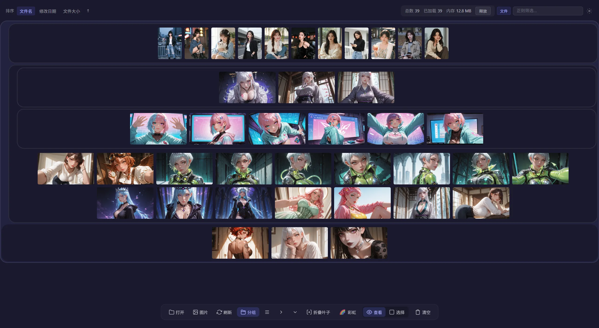
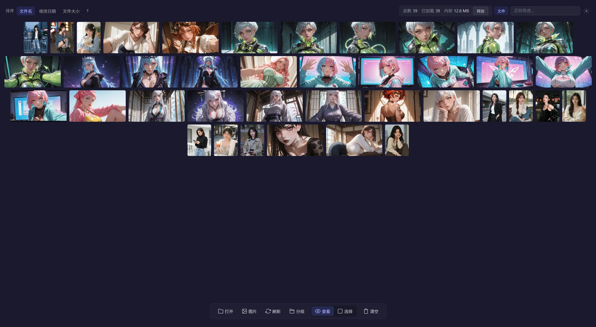

# 格图X - 图片分组浏览器

[bilibili视频演示](https://www.bilibili.com/video/BV1hHLi6ZE8P/)

<table>
	<tr>
		<td align="center">分组视图</td>
		<td align="center">彩虹视图</td>
	</tr>
	<tr>
		<td align="center">分组无标题视图</td>
		<td align="center">无分组视图</td>
	</tr>
	<tr>
		<td align="center">大图模式</td>
		<td align="center">对比模式</td>
	</tr>
</table>

# 核心功能
分组网格视图：
1. 以文件夹作为分组；或可手动创建临时分组；
2. 每组以网格视图组织；
3. 多组集合查看
4. 支持彩虹模式（按层级着色）
# 其他功能
对比功能
1. 可选择两张图片进行对比

筛选功能
1. 可按文件名、分组、路径 进行筛选；
2. 可保存为预设

性能相关
1. 支持异步扫描、异步加载、懒加载

# 文档
[功能清单](Docs/功能清单.md)
[技术架构](Docs/技术架构.md)
[开发指南](Docs/开发指南.md)
